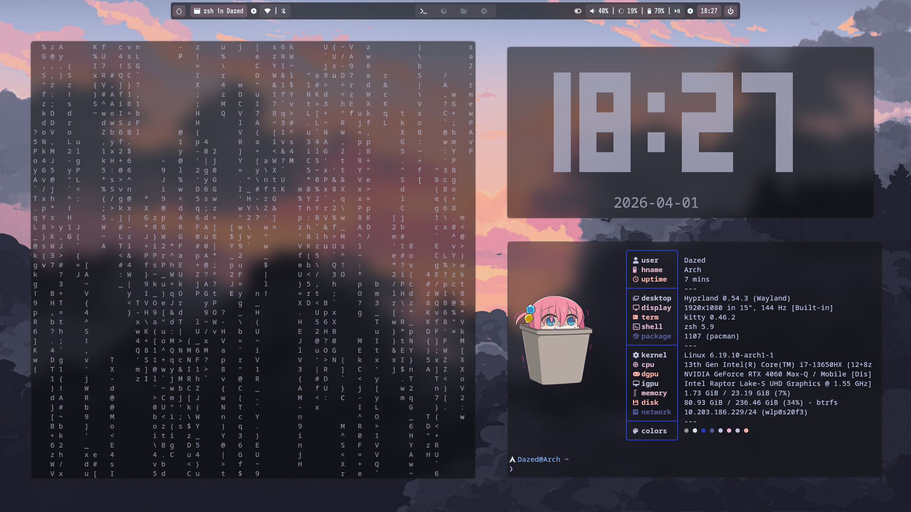
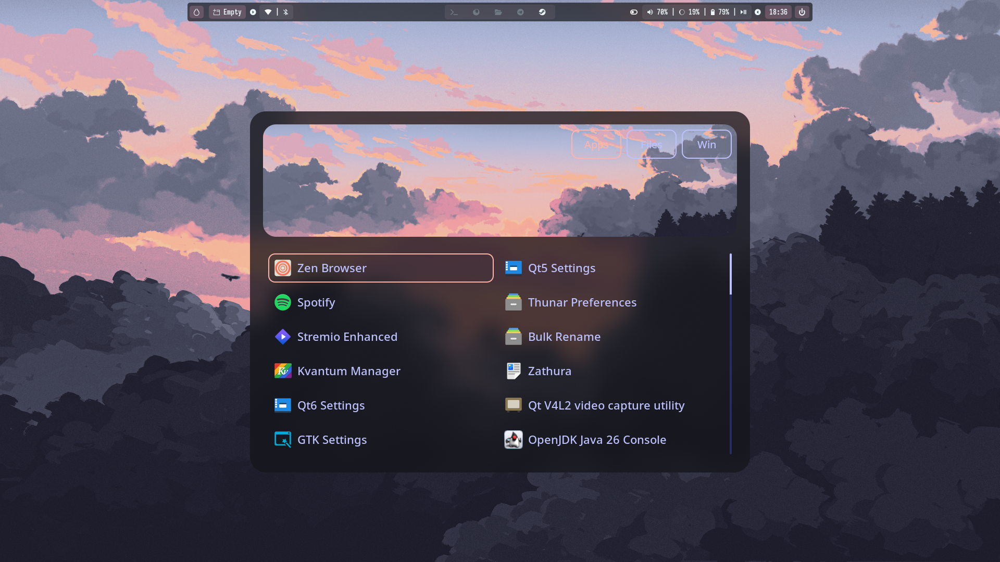
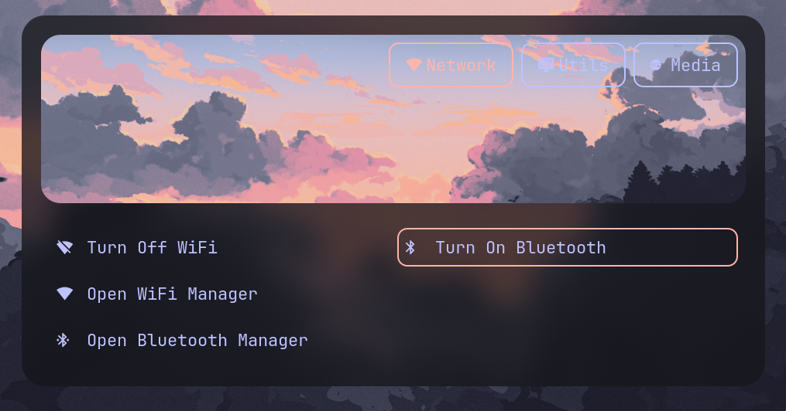
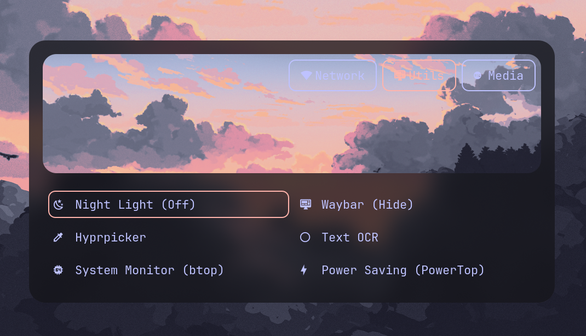
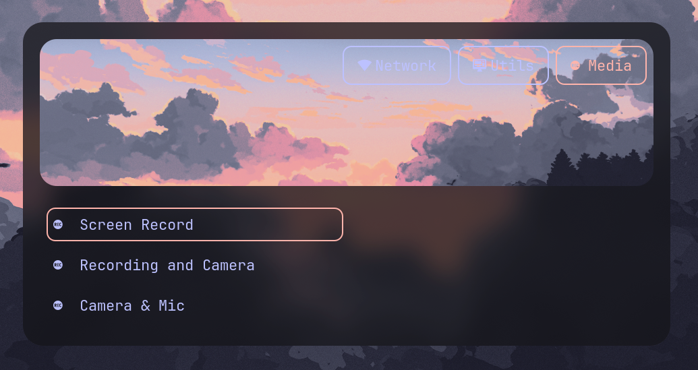
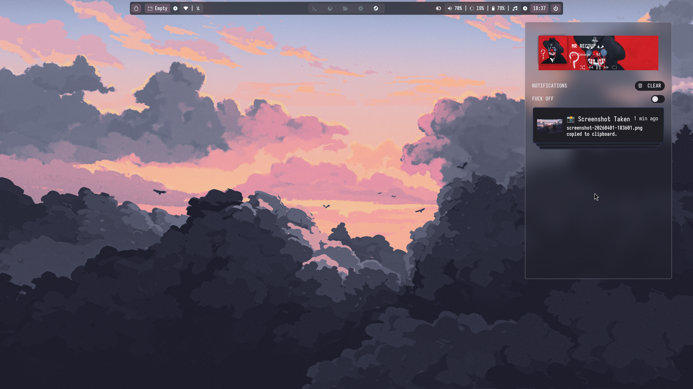

# ArchDotfiles

> Personal configuration files for my Arch Linux setup. Shared under GPL for anyone who finds it useful.

---

## Screenshot

### 📸 Showcase

<p align="center">
  
  <br>
  <em>Main Desktop: Hyprland + Waybar + Matugen</em>
</p>

---

#### 🚀 App Launcher

<p align="center">
  
  <br>
</p>

---

#### 🛠️ Control Center & Utilities

|                  Network & BT                   |                   System Utils                    |
| :---------------------------------------------: | :-----------------------------------------------: |
|  |      |
|               **Media Controls**                |             **SwayNC Notifications**              |
|    |  |

---

#### 🎥 Workflow Demo

<p align="center">
  <video src="PASTE_GITHUB_VIDEO_URL_HERE" width="100%" controls muted loop></video>
</p>

## Contents

### 🖥️ Desktop Environment

| Config     | Description                                                                 |
| ---------- | --------------------------------------------------------------------------- |
| `hyprland` | Wayland compositor — keybinds, animations, workspace rules, scroller layout |
| `hypridle` | Idle management — dim, lock, backlight, suspend                             |
| `hyprlock` | Lock screen                                                                 |
| `wlogout`  | Session logout menu                                                         |
| `sddm`     | Login manager                                                               |
| `waybar`   | Status bar                                                                  |
| `rofi`     | App launcher and menus                                                      |
| `swaync`   | Notification center                                                         |
| `matugen`  | Material You color generation                                               |

### 🎵 Music & Audio

| Config      | Description                                                    |
| ----------- | -------------------------------------------------------------- |
| `mpd`       | Music Player Daemon                                            |
| `rmpc`      | MPD TUI client — custom layout, theme, lyrics, cava visualizer |
| `mpDris`    | MPRIS bridge for MPD                                           |
| `spicetify` | Spotify client theming                                         |

### 🎬 Media

| Config             | Description             |
| ------------------ | ----------------------- |
| `mpv`              | Media player            |
| `jerry`            | Anime CLI tool          |
| `Seanime`          | Anime WebUI             |
| `stremio-enhanced` | Streaming client        |
| `yt-x`             | Terminal YouTube client |

### 🛠️ Terminal & Shell

| Config     | Description           |
| ---------- | --------------------- |
| `kitty`    | Terminal emulator     |
| `nvim`     | Neovim editor config  |
| `yazi`     | Terminal file manager |
| `ohmyposh` | Shell prompt theme    |
| `.zshrc`   | Zsh shell config      |

### 📊 System

| Config      | Description       |
| ----------- | ----------------- |
| `btop`      | Resource monitor  |
| `fastfetch` | System info fetch |

---

## Installation

These are managed via manual symlinks. There is no automated install script — clone the repo and symlink what you need.

```bash
git clone https://github.com/Dazed-04/Arch-dotfiles.git ~/.dotfiles
```

Then symlink individual configs, for example:

```bash
ln -s ~/.dotfiles/configs/hyprland ~/.config/hypr
ln -s ~/.dotfiles/configs/kitty ~/.config/kitty
ln -s ~/.dotfiles/configs/nvim ~/.config/nvim
# etc.
```

---

## Dependencies

A non-exhaustive list of packages needed for everything to work.

**Desktop Environment**

```
hyprland hypridle hyprlock
waybar rofi swaync matugen
wlogout sddm
```

**Music & Audio**

```
mpd mpc mpdris
rmpc playerctl
spicetify-cli
cava
```

**Media**

```
mpv jerry
stremio-enhanced
Seanime yt-x
```

**Terminal & Shell**

```
kitty neovim yazi
oh-my-posh zsh
chafa
```

**System**

```
btop fastfetch
```

Most are available in the official Arch repos or AUR:

```bash
# Official repos
sudo pacman -S hyprland hypridle hyprlock kitty neovim yazi mpd mpv btop fastfetch zsh chafa waybar rofi sddm

# AUR
yay -S hyprscroller rmpc spicetify-cli matugen oh-my-posh wlogout swaync
```

---

## Notes

- Configs are tailored to my specific setup and may need adjustments for yours
- Some scripts reference absolute paths to `/home/Dazed/` — you'll need to update these
- The rmpc layout uses a custom theme with cava visualizer, lyrics pane, and album art

---

## License

[GPL-3.0](LICENSE)
